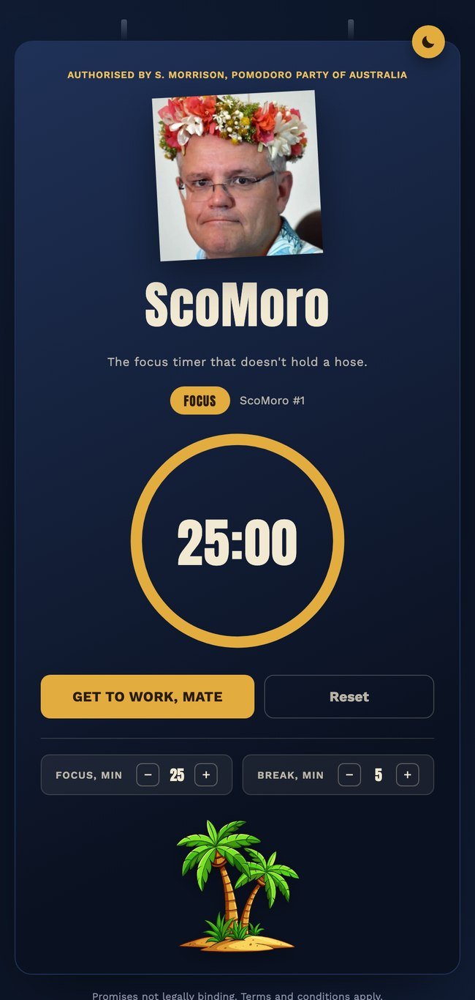
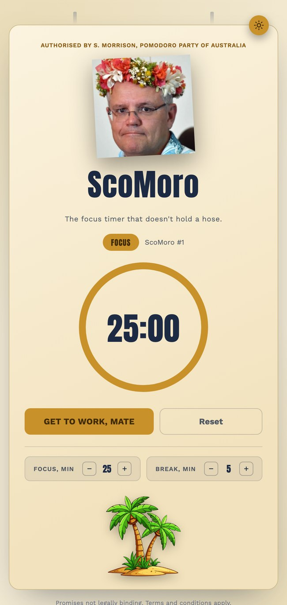

# ScoMoro

A Scott Morrison–themed Pomodoro timer. Simple concept: standard 25-minute focus / 5-minute break timer, styled like an Australian election corflute (navy, gold, "Authorised by" fine print), with a couple of era-appropriate jokes worked in — the crossed-trunk palm island at the bottom is a nod to the infamous Hawaii-during-the-bushfires trip.

Not a serious productivity tool. Just a pomodoro timer with the bit.

<p align="center">
  
</p>

## How it works

- The **GET TO WORK, MATE** button starts a 25-minute focus block by default. The ring drains gold as it counts down, and the browser tab title updates live with the time remaining.
- The **FOCUS / BREAK pill** next to the session counter shows which phase you're in. It's not static — when a focus block finishes (a two-tone chime plays), it automatically flips to **BREAK**, the pill and ring switch to coral, and the button label changes to "She'll be right, have a break." Finish the break and it flips straight back to FOCUS. The timer always pauses between phases rather than auto-continuing — you start each one yourself.
- **ScoMoro #1** is a running count of completed focus blocks, not just a decoration — it increments by one every time a focus session finishes and hands over to a break. Hitting **Reset** stops the timer and takes both the phase and the counter back to Focus #1.
- The **Focus, min** / **Break, min** steppers under the buttons adjust the length of each phase (focus in 5-minute steps from 5–60, break in 1-minute steps from 1–30) — changes apply immediately if you're editing the phase currently showing, and take effect next time otherwise. They're locked while the timer is running, so you can't change the length mid-countdown.
- The **portrait** and **light/dark toggle** are covered in their own sections below.

## About this project

This started as an experiment to see how far a single Claude Code conversation could take a small, silly, front-end-only idea — from a first working timer through theming, responsive fixes, redrawn artwork, and general cleanup — without ever leaving the chat to hand-edit code. Everything in this repo, aside from the two image assets credited below, came out of that back-and-forth.

- **Model:** Claude Sonnet 5, via Claude Code.
- **Time to build:** roughly 4 hours start-to-finish, after I thought of the idea.

## Structure

```
index.html                  the markup
css/scomoro-styles.css      all styling, incl. light/dark theming via CSS custom properties
js/
  theme-init.js             runs before first paint — applies a saved theme choice early to avoid a flash
  app.js                    portrait picker, theme toggle, timer logic
images/
  scomo-holiday.jpg         portrait shown in the card
  palm-trees.png            the palm-island image at the bottom of the card, resized + compressed
screenshots/
  preview-dark.jpg          dark mode screenshot used in this README
  preview-light.jpg         light mode screenshot used in this README
```

## Running it

No build step — it's plain HTML/CSS/JS. Either open `index.html` directly in a browser, or serve the folder locally:

```bash
python3 -m http.server 8000
```

then visit `http://localhost:8000`.

## Swapping assets

The footer graphic is just a file the page points at (`images/palm-trees.png`, referenced from `index.html`) — replace it with anything of your own (same filename, or update the ``) and the page picks it up with no other code changes.

It's shown at 150px wide, so there's no reason to ship a source image any larger than it needs to be for a sharp display at that size on a high-DPI screen. If you swap in your own file and it comes out of a design tool or phone camera, it's worth resizing it down first (and running it through a PNG/JPEG compressor).

## Adding more portraits

The portrait picks randomly on each page load from the `PORTRAITS` array near the top of `js/app.js`:

```js
var PORTRAITS = [
  'images/scomo-holiday.jpg'
];
```

To add more, drop the file into `images/` and add its path to that array, e.g.:

```js
var PORTRAITS = [
  'images/scomo-holiday.jpg',
  'images/scomo-holding-koala.png',
  'images/scomo-cricket.png'
];
```

Any aspect ratio works — the portrait is shown at a fixed width with height scaling to match, sitting on a slight tilt.

## Light / dark mode

Follows your system preference by default. The toggle badge in the top-right corner of the card switches it explicitly and remembers your choice (via `localStorage`) across visits.

<p>
  
  
</p>

## Image sources & licensing

This is a personal, non-commercial project — not something I expect to be distributed. The two photo/image assets reflect that:

- **`images/scomo-holiday.jpg`** — Scott Morrison, cropped from a press photograph. Source: [thenewdaily.com.au](https://www.thenewdaily.com.au/news/politics/australian-politics/2021/04/22/scott-morrison-not-my-job)
- **`images/palm-trees.png`** — Palm tree illustration, an unlicensed watermarked preview kept intentionally as a placeholder rather than purchased. Source: [freepik.com](https://www.freepik.com/vectors/palm-tree-cartoon)